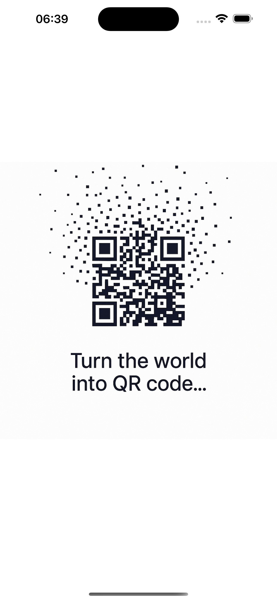
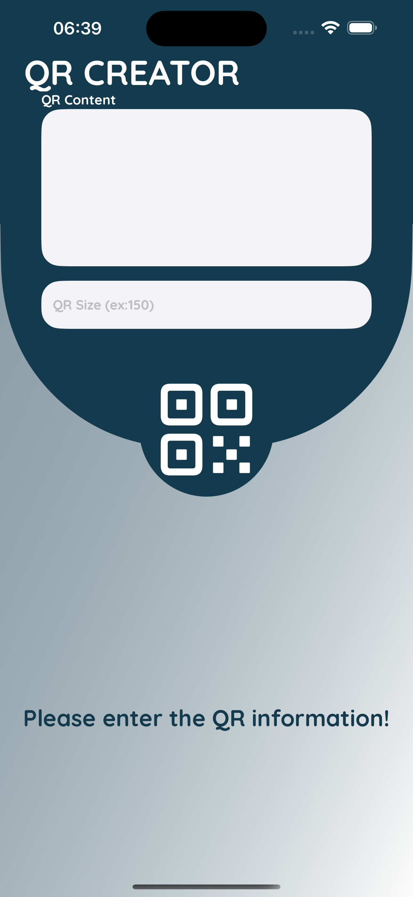
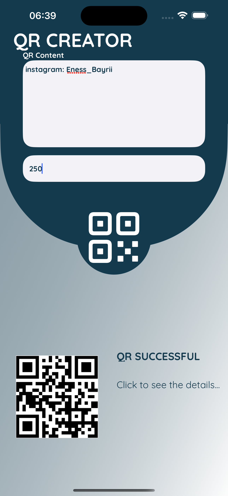

# QR Creator – Swift iOS App

**Turn the world into QR code...**

QR Creator is a minimalist, high-performance iOS application crafted in **Swift with UIKit**, enabling seamless QR code creation and downloading.
Tailored for both enterprise and individual use cases, the app features a modern interface and clean architecture, delivering an intuitive and efficient user experience.

## 📸 UI Screenshots

Below are sample interface views of the application:






## 🚀 Key Features

- QR Code generation using a RESTful API
- Secure image download and save functionality
- Gradient-enhanced user interface
- MVVM-based modular codebase
- Custom UIKit components for dynamic rendering

## 🧱 Architecture Overview

Layered MVVM structure with service isolation:

```
Services/
├── QRService.swift
├── ImageDownloadService.swift

ViewModels/
├── QRViewModel.swift
├── ImageDownloadViewModel.swift

Controllers/
├── ViewController.swift
├── DetailsVC.swift
```

## 📱 Technology Stack

- Swift 5
- UIKit
- SDWebImage
- PhotoKit
- URLSession
- Deployment Target: iOS 14.0+

## 📦 Installation Guide

Clone the repository and open the `.xcodeproj` file:

```bash
git clone https://github.com/your-username/qrcreator-ios.git
cd qrcreator-ios
open QRCreator.xcodeproj
```

## 🧠 Planned Enhancements

- Customizable QR style (color, padding)
- Offline QR generation support via CoreImage
- App localization for multilingual support
- Unit & UI test coverage (XCTest)

## 📄 License

MIT License © Your Name / Organization

## 📬 Contact

Business inquiries and partnerships:
📧 your.email@example.com
🌐 [your-website.com](https://your-website.com)
